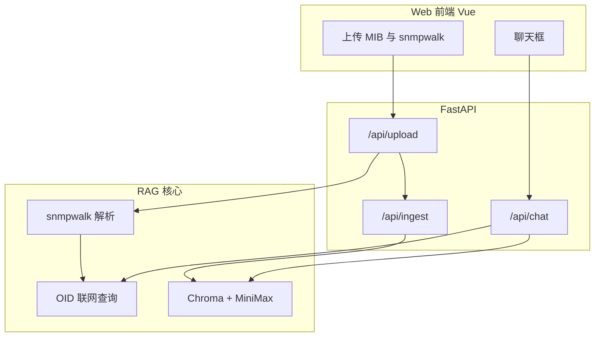

# AI-Analyze-MIB

> 基于 RAG 的 **MIB / snmpwalk** 智能分析平台 —— Web 上传 + 向量检索 + OID 联网解析 + MiniMax 问答。

将企业私有 MIB 与 `snmpwalk` 结果上传至网页，系统自动解析 OID、构建知识库索引，并在聊天框中给出有据可依的分析结论。对标准公共 OID 与未知企业 OID，支持 **Observium MIB 库** 与 **DuckDuckGo 联网搜索** 实时查询。

---

## 特性

- **Web 界面**：Vue 3 + Element Plus，拖拽上传 MIB / snmpwalk，聊天分析
- **FastAPI 后端**：文件上传、后台索引、流式问答 REST API
- **snmpwalk 解析**：自动提取 OID，生成 OID 解析报告并纳入 RAG
- **OID 联网查询**：标准 MIB 本地库 → Observium → 联网搜索（问答时亦可实时查 OID）
- **CLI 仍可用**：`rag_assistant.py` 支持 ingest / chat / ask
- **本地向量库**：Chroma + 中文 Embedding，数据留在本机

---

## 架构概览



---

## 环境要求

| 项目 | 说明 |
|------|------|
| Python | 3.10+ |
| Node.js | 18+（前端开发） |
| 网络 | HuggingFace（Embedding）、MiniMax API、OID 联网查询 |
| API Key | [MiniMax 开放平台](https://platform.minimaxi.com/) |

---

## 快速开始（Web）

### 1. 后端

```bash
git clone https://github.com/AGkite/AI-Analyze-MIB.git
cd AI-Analyze-MIB/ai-python

python -m venv .venv
.venv\Scripts\activate          # Windows
# source .venv/bin/activate     # macOS / Linux

pip install -r requirements.txt
cp .env.example .env            # 填入 MINIMAX_API_KEY

python run_api.py
```

API 默认运行在 http://127.0.0.1:8000 ，文档见 http://127.0.0.1:8000/docs

### 2. 前端

```bash
cd ../frontend
npm install
npm run dev
```

浏览器打开 http://localhost:5173

### 3. 使用流程

1. 上传企业 `.mib` 与 `snmpwalk` / `.walk` 文件
2. 等待后台索引完成（页面会显示状态）
3. 在聊天框提问，例如：
   - `walk 里 1.3.6.1.4.1.99999.1.1.0 对应 MIB 中哪个对象？`
   - `列出所有未识别的 OID 并解释可能含义`

---

## CLI 用法（可选）

```bash
cd ai-python
python rag_assistant.py ingest
python rag_assistant.py chat
python rag_assistant.py ask "cpuUsage 的访问权限是什么？"
```

---

## API 一览

| 方法 | 路径 | 说明 |
|------|------|------|
| GET | `/api/health` | 健康检查 |
| POST | `/api/upload` | 上传 MIB / snmpwalk（`auto_ingest=true` 自动建索引） |
| POST | `/api/ingest` | 手动触发索引重建 |
| GET | `/api/ingest/status` | 索引任务状态 |
| GET | `/api/files` | 知识库文件列表 |
| POST | `/api/chat` | 问答（含 OID 实时查询） |
| POST | `/api/chat/stream` | SSE 流式问答 |
| POST | `/api/oid/lookup` | 单个 OID 联网解析 |

---

## OID 解析策略

| 顺序 | 来源 | 说明 |
|------|------|------|
| 1 | 本地标准库 | `1.3.6.1.2.1.*` 等 SNMPv2-MIB 常见 OID |
| 2 | Observium | https://mibs.observium.org 在线 MIB 库 |
| 3 | 联网搜索 | DuckDuckGo 检索 OID 含义 |
| 4 | 私有 MIB | 结合用户上传的 MIB，由 RAG 上下文回答 |

上传 snmpwalk 时会批量解析并生成 `knowledge-base/generated/oid-analysis-*.md` 报告。

---

## 项目结构

```
AI-Analyze-MIB/
├── README.md
├── frontend/                 # Vue 3 前端
│   ├── src/
│   │   ├── App.vue
│   │   ├── api/client.js
│   │   └── components/
│   └── package.json
└── ai-python/
    ├── api/                  # FastAPI 路由
    ├── rag/                  # RAG、snmpwalk、OID 查询
    ├── run_api.py            # 启动后端
    ├── rag_assistant.py      # CLI
    └── knowledge-base/
        ├── mib/
        ├── snmpwalk/
        └── generated/        # OID 报告（运行时生成）
```

---

## 配置项

见 [`ai-python/.env.example`](ai-python/.env.example)。常用项：

| 变量 | 说明 |
|------|------|
| `MINIMAX_API_KEY` | **必填** |
| `EMBEDDING_MODEL` | 默认 `BAAI/bge-small-zh-v1.5` |
| `API_PORT` | 默认 `8000` |
| `CORS_ORIGINS` | 前端地址，默认 `http://localhost:5173` |

---

## 技术栈

- **后端**：FastAPI、LangChain、Chroma、sentence-transformers、httpx、duckduckgo-search
- **前端**：Vue 3、Vite、Element Plus、Axios
- **LLM**：MiniMax（OpenAI 兼容 API）

---

## 常见问题

<details>
<summary><b>索引一直显示构建中</b></summary>

首次 ingest 需下载 Embedding 模型，可能需数分钟。查看后端终端日志。
</details>

<details>
<summary><b>OID 联网查询失败</b></summary>

确认服务器可访问外网。企业内网可配置 HTTP 代理，或仅依赖上传的 MIB + RAG。
</details>

<details>
<summary><b>前端无法连接 API</b></summary>

确认 `python run_api.py` 已启动，且 Vite 代理指向 `127.0.0.1:8000`。
</details>

---

## 许可证

本项目尚未指定开源许可证。
