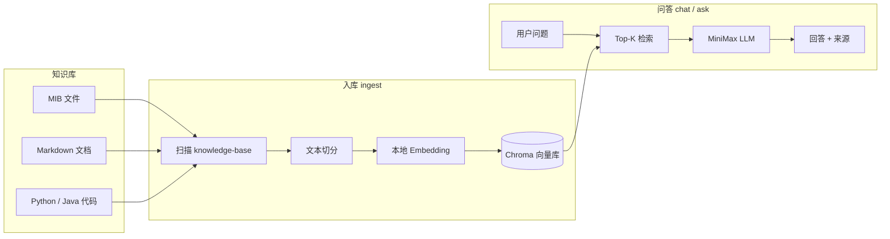

# AI-Analyze-MIB

> 基于 RAG 的私有知识库助手 —— 针对 **MIB 文档**、**SNMP 相关代码** 与内部技术资料进行检索增强问答。

将企业内部的 MIB 定义、运维文档与代码片段放入本地知识库，通过向量检索 + MiniMax 大模型，实现「有据可依」的智能分析，避免模型凭空编造 OID 或 API。

---

## 特性

- **多格式知识库**：支持 `.mib`、`.md`、`.py`、`.java`、`.json`、`.yml` 等常见格式
- **本地向量检索**：使用 [Chroma](https://www.trychroma.com/) 持久化向量库，数据留在本机
- **中文 Embedding**：默认 `BAAI/bge-small-zh-v1.5`，适合中文技术文档
- **MiniMax 驱动回答**：通过 OpenAI 兼容 API 调用 MiniMax 模型
- **来源可追溯**：每次回答附带参考文件路径，便于核对
- **三种使用方式**：单次问答、交互对话、仅重建索引

---

## 架构概览



---

## 环境要求

| 项目 | 说明 |
|------|------|
| Python | 3.10+（推荐 3.11 / 3.12） |
| 磁盘 | 首次入库需下载 Embedding 模型（约数百 MB） |
| 网络 | 入库阶段需访问 HuggingFace；问答阶段需访问 MiniMax API |
| API Key | [MiniMax 开放平台](https://platform.minimaxi.com/) 获取 |

---

## 快速开始

### 1. 克隆仓库

```bash
git clone https://github.com/AGkite/AI-Analyze-MIB.git
cd AI-Analyze-MIB/ai-python
```

### 2. 创建虚拟环境并安装依赖

```bash
python -m venv .venv

# Windows
.venv\Scripts\activate

# macOS / Linux
source .venv/bin/activate

pip install -r requirements.txt
```

### 3. 配置环境变量

```bash
cp .env.example .env
```

编辑 `.env`，至少填入你的 `MINIMAX_API_KEY`：

```env
MINIMAX_API_KEY=your_api_key_here
MINIMAX_MODEL=MiniMax-M2.7
EMBEDDING_MODEL=BAAI/bge-small-zh-v1.5
```

> `.env` 已加入 `.gitignore`，请勿将密钥提交到 Git。

### 4. 准备知识库

将资料放入 `knowledge-base/` 目录（可按子目录组织）：

```
knowledge-base/
├── mib/          # SNMP MIB 定义文件
├── docs/         # 说明文档、运维手册
└── code/         # 相关客户端或工具代码
```

仓库已附带示例文件，可直接用于体验。

### 5. 构建向量索引

```bash
python rag_assistant.py ingest
```

首次运行会下载 Embedding 模型并写入 `chroma-data/`（已忽略，不会进入 Git）。

### 6. 开始问答

**交互模式：**

```bash
python rag_assistant.py chat
```

**单次提问：**

```bash
python rag_assistant.py ask "MY-SYSTEM-MIB 中 cpuUsage 的 OID 后缀是多少？"
```

---

## 命令说明

| 命令 | 说明 |
|------|------|
| `python rag_assistant.py ingest` | 扫描 `knowledge-base/`，切分文本并写入 Chroma |
| `python rag_assistant.py chat` | 进入交互式问答（输入 `退出` / `exit` / `quit` 结束） |
| `python rag_assistant.py ask "问题"` | 单次问答并打印参考来源 |

更新知识库文件后，需重新执行 `ingest` 以刷新索引。

---

## 项目结构

```
AI-Analyze-MIB/
├── README.md
├── .gitignore
└── ai-python/
    ├── .env.example          # 环境变量模板
    ├── requirements.txt      # Python 依赖
    ├── rag_assistant.py      # CLI 入口
    ├── minimax.py            # MiniMax API 直连示例（非 RAG）
    ├── knowledge-base/       # 待索引的原始资料
    │   ├── mib/
    │   ├── docs/
    │   └── code/
    ├── chroma-data/          # 向量库（运行 ingest 后生成，已忽略）
    └── rag/
        ├── config.py         # 路径、模型与 RAG 参数
        ├── loaders.py        # 知识库文件加载
        ├── ingest.py         # 入库流程
        └── assistant.py      # 检索链与问答逻辑
```

---

## 配置项

所有配置均可在 `ai-python/.env` 中覆盖，完整列表见 [`.env.example`](ai-python/.env.example)。

| 变量 | 默认值 | 说明 |
|------|--------|------|
| `MINIMAX_API_KEY` | — | **必填**，MiniMax API 密钥 |
| `MINIMAX_BASE_URL` | `https://api.minimaxi.com/v1` | API 基地址 |
| `MINIMAX_MODEL` | `MiniMax-M2.7` | 对话模型 |
| `EMBEDDING_MODEL` | `BAAI/bge-small-zh-v1.5` | 本地 Embedding 模型 |
| `RAG_CHUNK_SIZE` | `800` | 文本块大小（字符） |
| `RAG_CHUNK_OVERLAP` | `120` | 块重叠长度 |
| `RAG_TOP_K` | `4` | 每次检索返回的文档段数量 |

---

## 支持的文件类型

`.mib` · `.txt` · `.md` · `.py` · `.java` · `.yml` · `.yaml` · `.json`

其他后缀的文件会被扫描时自动跳过。如需扩展，可修改 `rag/config.py` 中的 `SUPPORTED_SUFFIXES`。

---

## 技术栈

- [LangChain](https://github.com/langchain-ai/langchain) — RAG 编排与文档链
- [Chroma](https://www.trychroma.com/) — 向量数据库
- [sentence-transformers](https://www.sbert.net/) / HuggingFace — 本地 Embedding
- [MiniMax](https://www.minimaxi.com/) — 大语言模型（OpenAI 兼容接口）

---

## 示例问题

在默认示例知识库入库后，可尝试：

- `cpuUsage 对象的最大访问权限是什么？`
- `如何用 Python 读取 CPU 使用率？`
- `MY-SYSTEM-MIB 包含哪些监控指标？`

---

## 常见问题

<details>
<summary><b>提示「向量库不存在」</b></summary>

请先执行 `python rag_assistant.py ingest` 完成索引构建。
</details>

<details>
<summary><b>提示「未设置 MINIMAX_API_KEY」</b></summary>

确认已在 `ai-python/.env` 中配置密钥，且文件名、路径正确。
</details>

<details>
<summary><b>首次 ingest 很慢</b></summary>

正常现象。需要从 HuggingFace 下载 Embedding 模型，并逐文件切分、向量化。
</details>

<details>
<summary><b>回答显示「资料中未找到相关信息」</b></summary>

说明检索片段不足以回答问题。可尝试：补充 `knowledge-base/` 内容、调大 `RAG_TOP_K`、减小 `RAG_CHUNK_SIZE` 后重新 `ingest`。
</details>

<details>
<summary><b>HuggingFace 下载失败</b></summary>

可配置镜像或代理，例如：

```bash
# Windows PowerShell
$env:HF_ENDPOINT = "https://hf-mirror.com"

# macOS / Linux
export HF_ENDPOINT=https://hf-mirror.com
```

然后重新执行 `ingest`。
</details>

---

## 开发说明

- 修改 `rag/` 模块逻辑后，无需重装依赖，但变更知识库内容后需重新 `ingest`
- `chroma-data/`、`.env`、虚拟环境目录已在 `.gitignore` 中排除
- 欢迎通过 Issue / Pull Request 贡献 MIB 解析优化、更多 Loader 或部署方案

---

## 许可证

本项目尚未指定开源许可证。如需二次分发，请先与仓库维护者确认。
